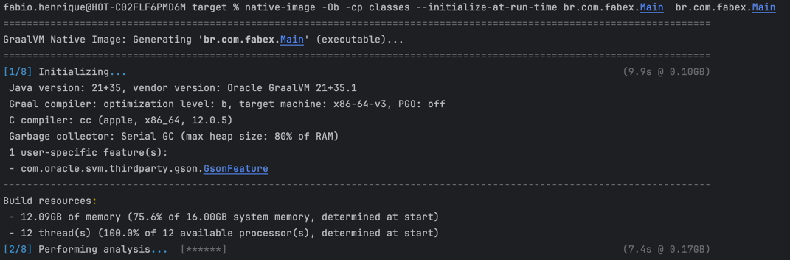
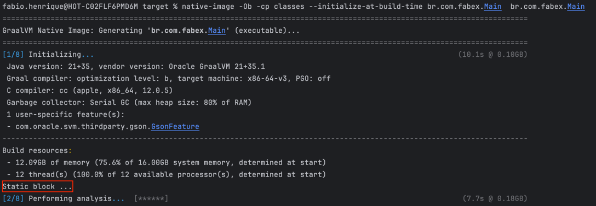
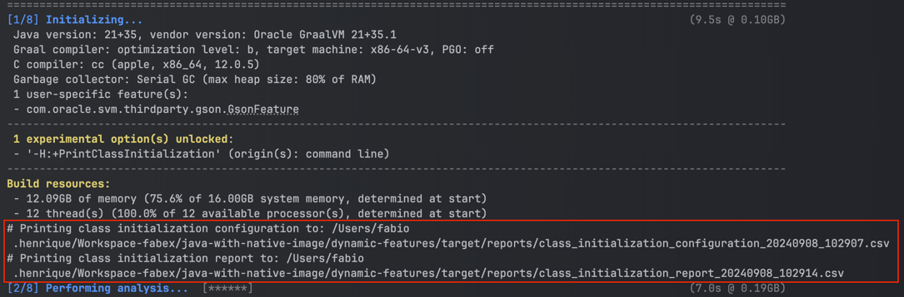

# Native image with dynamic-features 

The principal objective is show some examples about dynamic features in generate native image.

## Commands

### Native image with Resources (`Class.getResource()`,`Class.getResourceAsStream()`, `ClassLoader`)
In all commands wil use `-H:Log=registerResource:<log level>` for visualize details about resources used in generate image. The <log level> argument must be in the range 1 to 5 (from least detailed to most detailed). A log level of 3 provides brief details of the included resources.

#### Using `-H:IncludeResources` (regex)
```
native-image -Ob -cp classes -H:IncludeResources="file.txt$"  br.com.fabex.NativeImageWithResource
```
#### Using `-H:ResourceConfigurationFiles`
```
native-image -Ob -cp classes -H:ResourceConfigurationFiles=classes/resource-config.json  br.com.fabex.NativeImageWithResource
```

### Native image (at-run-time & at-build-time)

#### at-run-time (default)
In this mode, static block is not printed in build time!
```
native-image -Ob -cp classes --initialize-at-run-time br.com.fabex.RunAndBuildTime  br.com.fabex.RunAndBuildTime
```
<details>
<summary>Output</summary>

</details>

####  at-build-time
In this mode, static block is printed in build time!
```
native-image -Ob -cp classes --initialize-at-build-time br.com.fabex.RunAndBuildTime  br.com.fabex.RunAndBuildTime
```
<details>
<summary>Output</summary>

</details>

#### With -H:+PrintClassInitialization

```
native-image -Ob -cp classes --initialize-at-run-time br.com.fabex.RunAndBuildTime -H:+PrintClassInitialization br.com.fabex.RunAndBuildTime
```
<details>
<summary>Output</summary>

</details>


---

### Run

``` commandline
./br.com.fabex.RunAndBuildTime    
```
### Native image with Build Report
```
native-image -H:+BuildReport -H:+BuildReportSamplerFlamegraph -cp target/classes br.com.fabex.RunAndBuildTime
```
